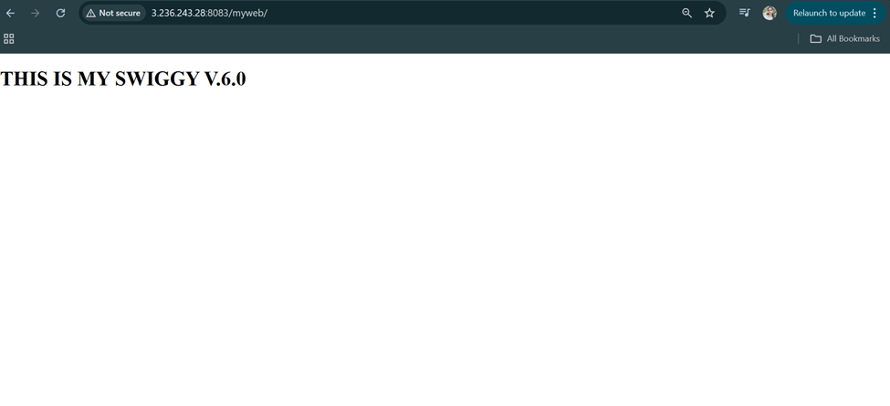

# ` ADVANCED DEVOPS PLATFORM CAPSTONE`

Complete Documentation with Steps & Commands

### PROJECT OVERVIEW :

###  Project Name : Advanced DevOps Platform Capstone

### Objective :
Build a fully automated DevOps platform where:

* Infrastructure is created using Terraform

* Software is installed using Ansible

* CI/CD is handled by Jenkins

* Code quality is enforced by SonarQube

* Artifacts are stored in Nexus

* Docker images are built remotely

*  No manual server configuration
*  No UI-based infra creation
*  Everything done via Linux terminal
*  Failures are tested and fixed using code

### TOOLS USED :

| Tool      | Purpose                      |
| --------- | ---------------------------- |
| Terraform | Infrastructure provisioning  |
| Ansible   | Configuration management     |
| Jenkins   | CI/CD automation             |
| Docker    | Application containerization |
| SonarQube | Code quality checks          |
| Nexus     | Artifact storage             |
| GitHub    | Source control               |
| AWS       | Cloud provider               |
| Linux     | Execution environment        |

## PROJECT DIRECTORY STRUCTURE :

### Create project directory :

    mkdir ~/devops-platform-capstone
    cd ~/devops-platform-capstone

### Initialize Git :

    git init

### Create folders :

    mkdir terraform ansible jenkins app docs

### Verify :

    tree

### Expected:

devops-platform-capstone/

├── terraform/

├── ansible/

├── jenkins/

├── app/

├── docs/

└── README.md

## PHASE 1 — TERRAFORM (INFRASTRUCTURE)

### Purpose

Terraform only creates infrastructure, not software.

### Install Terraform (Linux) :

    sudo apt update

    sudo apt install -y wget unzip

    
    wget https://releases.hashicorp.com/terraform/1.6.6/terraform_1.6.6_linux_amd64.zip

    
    unzip terraform_1.6.6_linux_amd64.zip

    sudo mv terraform /usr/local/bin/

    terraform -version

### Terraform Backend Setup (Remote State) :

  Step 1: Go to terraform directory

     cd terraform

 Step 2: Create backend file

    nano backend.tf

Paste this 

      terraform {
        backend "s3" {
        bucket         = "devops-platform-tfstate"
        key            = "global/terraform.tfstate"
        region         = "us-east-1"
        dynamodb_table = "terraform-locks"
        encrypt        = true
        }
     }

Step 3: Initialize Terraform :

    terraform init

Failure Test (Mandatory) 

Open two terminals and run: 

     terraform apply

One terminal fails with state lock error

Explanation:
Terraform uses locking to prevent state corruption when multiple users run it.

## Network Module :

### Create module :

    mkdir -p modules/network

    cd modules/network
    touch main.tf variables.tf outputs.tf

* main.tf 

      # Create VPC
      resource "aws_vpc" "this" {
        cidr_block = var.vpc_cidr
        tags = {
          Name = "devops-vpc"
        }
      }

      # Create Subnet (public)
      resource "aws_subnet" "this" {
        vpc_id                  = aws_vpc.this.id
        cidr_block              = var.subnet_cidr
        availability_zone       = var.availability_zone
        map_public_ip_on_launch = true   # Automatically assign public IPs
        tags = {
          Name = "devops-subnet"
        }
      }

      # Create Internet Gateway
      resource "aws_internet_gateway" "this" {
         vpc_id = aws_vpc.this.id
         tags = {
          Name = "devops-igw"
         }
      }

      # Create Route Table for public subnet
      resource "aws_route_table" "public" {
        vpc_id = aws_vpc.this.id
        tags = {
          Name = "devops-public-rt"
        }
      }

      # Add route to IGW (internet access)
      resource "aws_route" "internet_access" {
        route_table_id         = aws_route_table.public.id
        destination_cidr_block = "0.0.0.0/0"
        gateway_id             = aws_internet_gateway.this.id
      }

      # Associate Route Table with subnet
      resource "aws_route_table_association" "subnet_assoc" {
         subnet_id      = aws_subnet.this.id
         route_table_id = aws_route_table.public.id
      }

 * variables.tf :

       variable "vpc_cidr" {}
       variable "subnet_cidr" {}
       variable "availability_zone" {}

* output.tf :

  

      output "vpc_id" {
        value = aws_vpc.this.id
      }

      output "subnet_id" {
        value = aws_subnet.this.id
      }

      output "igw_id" {
        value = aws_internet_gateway.this.id
      }

### Resources created :

* Custom VPC

* Public Subnet

* Internet Gateway

* Route Table

### Security Groups Module :

    mkdir ../security
    cd ../security

| Service   | Port |
| --------- | ---- |
| Jenkins   | 8080,22 |
| SonarQube | 9000,22 |
| Nexus     | 8081,22 |
| Docker    | 22   |

* main.tf :

      resource "aws_security_group" "jenkins" {
        name        = "jenkins"
        description = "Allow Jenkins access"
        vpc_id      = var.vpc_id

        ingress {
          from_port   = 22
          to_port     = 22
          protocol    = "tcp"
          cidr_blocks = ["0.0.0.0/0"]   # Or your control node IP for more security
        }

        ingress {
          from_port   = 8080
          to_port     = 8080
          protocol    = "tcp"
          cidr_blocks = ["0.0.0.0/0"]
        }

        egress {
          from_port   = 0
          to_port     = 0
          protocol    = "-1"
          cidr_blocks = ["0.0.0.0/0"]
        }
      }

      resource "aws_security_group" "sonarqube" {
        name        = "sonarqube"
        description = "Allow SonarQube access"
        vpc_id      = var.vpc_id

        ingress {
          from_port   = 22
          to_port     = 22
          protocol    = "tcp"
          cidr_blocks = ["0.0.0.0/0"]   # Or your control node IP for more security
        }

        ingress {
          from_port   = 9000
          to_port     = 9000
          protocol    = "tcp"
          cidr_blocks = ["0.0.0.0/0"]
        }  

        egress {
          from_port   = 0
          to_port     = 0
          protocol    = "-1"
          cidr_blocks = ["0.0.0.0/0"]
        }
      }

      resource "aws_security_group" "nexus" {
        name        = "nexus"
        description = "Allow nexus access"
        vpc_id      = var.vpc_id

        ingress {
          from_port   = 22
          to_port     = 22
          protocol    = "tcp"
          cidr_blocks = ["0.0.0.0/0"]   # Or your control node IP for more security
        }

        ingress {
          from_port   = 8081
          to_port     = 8081
          protocol    = "tcp"
          cidr_blocks = ["0.0.0.0/0"]
        }

        egress {
          from_port   = 0
          to_port     = 0
          protocol    = "-1"
          cidr_blocks = ["0.0.0.0/0"]
        }
      }

      resource "aws_security_group" "docker" {
        name        = "docker"
        description = "Allow nexus access"
        vpc_id      = var.vpc_id

        ingress {
          from_port   = 22
          to_port     = 22
          protocol    = "tcp"
          cidr_blocks = ["0.0.0.0/0"]   # Or your control node IP for more security
        }

        egress {
          from_port   = 0
          to_port     = 0
          protocol    = "-1"
          cidr_blocks = ["0.0.0.0/0"]
        }
      }

* varaibles.tf:

      variable "vpc_id" {
        description = "VPC ID where the SGs will be created"
        type        = string
      }

* output.tf :

      output "jenkins_sg_id" {
        description = "Security Group ID for Jenkins"
        value       = aws_security_group.jenkins.id
        }

      output "sonarqube_sg_id" {
         description = "Security Group ID for SonarQube"
        value       = aws_security_group.sonarqube.id
      }

      output "nexus_sg_id" {
        value = aws_security_group.nexus.id
      }

      output "docker_sg_id" {
         value = aws_security_group.docker.id
      }

Apply all the Changes :
     
       terraform apply

  

* Compute Modules (EC2) :

      mkdir ../compute-jenkins ../compute-sonarqube ../compute-nexus ../compute-docker

   * Each module:

    * EC2 instance

     * IAM role

    * Security group

   * No software installation

   * No user_data

* main.tf in compute-jenkins :

      resource "aws_instance" "jenkins" {
        ami                    = var.ami
        instance_type           = var.instance_type
        subnet_id               = var.subnet_id
        vpc_security_group_ids  = [var.sg_id]
        key_name                = var.key_name
        associate_public_ip_address = true
        tags = {
          Name = "Jenkins-Server"
        }
      }

* varibles.tf :

      variable "ami" {}
      variable "instance_type" {}
      variable "subnet_id" {}
      variable "sg_id" {}
      variable "key_name" {}

* outputs.tf

      output "public_ip" {
      description = "Public IP of Jenkins instance"
      value       = aws_instance.jenkins.public_ip
      }

Note : Same for compute-sonarqube, compute-nexus and compute-docker.

Root main.tf :

    provider "aws" {
    region = "us-east-1"
    }

    module "network" {
     source = "./modules/network"

     vpc_cidr          = "10.0.0.0/16"
     subnet_cidr       = "10.0.1.0/24"
     availability_zone = "us-east-1a"
    }

    module "security" {
       source = "./modules/security"
       vpc_id = module.network.vpc_id
    }

    module "jenkins" {
     source       = "./modules/compute-jenkins"
     ami          = "ami-0ecb62995f68bb549"    #
     instance_type = "m7i-flex.large"
     subnet_id    = module.network.subnet_id
     sg_id        = module.security.jenkins_sg_id
     key_name     = "terraform-project"
    }

    module "sonarqube" {
      source       = "./modules/compute-sonarqube"
      ami          = "ami-0ecb62995f68bb549"
      instance_type = "m7i-flex.large"
      subnet_id    = module.network.subnet_id
      sg_id        = module.security.sonarqube_sg_id
      key_name     = "terraform-project"
    }

    # Repeat for Nexus and Docker modules

    module "nexus" {
     source       = "./modules/compute-nexus"
     ami          = "ami-0ecb62995f68bb549"
     instance_type = "m7i-flex.large"
     subnet_id    = module.network.subnet_id
     sg_id        = module.security.nexus_sg_id
    key_name     = "terraform-project"
    }

    module "docker" {
      source       = "./modules/compute-docker"
      ami          = "ami-0ecb62995f68bb549"
      instance_type = "m7i-flex.large"
      subnet_id    = module.network.subnet_id
      sg_id        = module.security.docker_sg_id
      key_name     = "terraform-project"
    }

Verify:

    terraform apply
    terraform output

Expected: 4 public IPs

### PHASE 2 — ANSIBLE (CONFIGURATION) :

Purpose : Ansible installs and maintains software.

Install Ansible :

    sudo apt install -y ansible
    ansible --version

Dynamic Inventory :

Export Terraform output :

     terraform output -json > ansible/inventory.json

Create inventory script:

    cd ansible
    nano inventory.py

    #!/usr/bin/env python3
    import json
    import os
    import sys

    BASE_DIR = os.path.dirname(os.path.abspath(__file__))
    inventory_file = os.path.join(BASE_DIR, "inventory.json")

    with open(inventory_file) as f:
       data = json.load(f)

    jenkins_ip = data["jenkins_public_ip"]["value"]
    sonarqube_ip = data["sonarqube_public_ip"]["value"]
    nexus_ip = data["nexus_public_ip"]["value"]
    docker_ip = data["docker_public_ip"]["value"]

    inventory = {
      "all": {
          "children": ["jenkins", "sonarqube", "nexus", "docker"]
       },
       "jenkins": {
         "hosts": [jenkins_ip]
        },
       "sonarqube": {
          "hosts": [sonarqube_ip]
       },
       "nexus": {
          "hosts": [nexus_ip]
       },
       "docker": {
          "hosts": [docker_ip]
       },
       "_meta": {
           "hostvars": {
              jenkins_ip: {
                "ansible_user": "ubuntu",
                "ansible_ssh_private_key_file": "/home/ubuntu/terraform-project.pem"
            },
            sonarqube_ip: {
                "ansible_user": "ubuntu",
                "ansible_ssh_private_key_file": "/home/ubuntu/terraform-project.pem"
            },
            nexus_ip: {
                "ansible_user": "ubuntu",
                "ansible_ssh_private_key_file": "/home/ubuntu/terraform-project.pem"
            },
            docker_ip: {
                "ansible_user": "ubuntu",
                "ansible_ssh_private_key_file": "/home/ubuntu/terraform-project.pem"
            }
        }
    }
    }

    print(json.dumps(inventory))
    
chmod +x inventory.py

Groups:

* jenkins

* sonarqube

* nexus

* docker

* No hardcoded IPs
* Inventory auto-updates

Jenkins Role :

    cd ~/devops-platform-capstone/ansible
    ansible-galaxy init roles/jenkins

You will get this :

roles/jenkins/

├── defaults/

│     └── main.yml

├── handlers/

│   └── main.yml

├── tasks/

│   └── main.yml

├── templates/

├── files/

└── meta/

└── main.yml

defaults/main.yml: 

Default variables for Jenkins :

    jenkins_http_port: 8080
    jenkins_admin_user: admin
    jenkins_admin_password: admin123
    jenkins_plugins:
      - git
      - workflow-aggregator
      - credentials
      - sonar
      - docker-workflow

handlers/main.yml :

 Restart Jenkins when needed

    - name: restart jenkins
      service:
        name: jenkins
        state: restarted

tasks/main.yml :

Main Jenkins installation logic :

     ---
     - name: Install Java (Jenkins dependency)
     apt:
       name: openjdk-11-jdk
       state: present
       update_cache: yes

     - name: Add Jenkins GPG key
     apt_key:
       url: https://pkg.jenkins.io/debian-stable/jenkins.io.key
       state: present

    - name: Add Jenkins repository
      apt_repository:
      repo: deb https://pkg.jenkins.io/debian-stable binary/
      state: present

    - name: Install Jenkins
      apt:
      name: jenkins
      state: present
      update_cache: yes
      notify: restart jenkins

    - name: Ensure Jenkins is started and enabled
    service:
      name: jenkins
      state: started
      enabled: yes

    - name: Wait for Jenkins to be available
    uri:
      url: http://localhost:{{ jenkins_http_port }}
      status_code: 200
      register: result
      retries: 10
     delay: 10
    until: result.status == 200

    - name: Download Jenkins CLI
     get_url:
       url: http://localhost:{{ jenkins_http_port }}/jnlpJars/jenkins-cli.jar
       dest: /tmp/jenkins-cli.jar

    - name: Install Jenkins plugins
     shell: >
       java -jar /tmp/jenkins-cli.jar
       -s http://localhost:{{ jenkins_http_port }}
       install-plugin {{ item }} -restart
     with_items: "{{ jenkins_plugins }}"

meta/main.yml :

    galaxy_info:
      role_name: jenkins
      author: devops-engineer
      description: Install and configure Jenkins server
      license: MIT
      min_ansible_version: 2.9

Run the Jenkins Role :

    ansible-playbook -i inventory.py site.yml

Expected:
* Java installed
* Jenkins installed
* Jenkins running
* Automatically Installed Plugins

Sonarqube :

      cd ~/devops-platform-capstone/ansible
      ansible-galaxy init roles/sonarqube

defaults/main.yml :

 All configurable values (no hardcoding)

  
    sonarqube_image: sonarqube:9.9-community
    sonarqube_container_name: sonarqube
    sonarqube_port: 9000

    sonarqube_data_dir: /opt/sonarqube/data
    sonarqube_extensions_dir: /opt/sonarqube/extensions
    sonarqube_logs_dir: /opt/sonarqube/logs

handlers/main.yml :

  Restart SonarQube when needed

    - name: restart sonarqube
      shell: docker restart {{ sonarqube_container_name }}

tasks/main.yml :

Main SonarQube installation logic :

    ---
    - name: Install required packages
      apt:
        name:
          - apt-transport-https
          - ca-certificates
          - curl
          - software-properties-common
        state: present
        update_cache: yes

    - name: Install Docker
      apt:
        name: docker.io
        state: present

    - name: Start and enable Docker
      service:
        name: docker
        state: started
        enabled: yes

    - name: Create SonarQube directories
      file:
        path: "{{ item }}"
        state: directory
        mode: '0755'
        loop:
          - "{{ sonarqube_data_dir }}"
          - "{{ sonarqube_extensions_dir }}"
          - "{{ sonarqube_logs_dir }}"

    - name: Pull SonarQube Docker image
      docker_image:
        name: "{{ sonarqube_image }}"
        source: pull

    - name: Run SonarQube container
      docker_container:
        name: "{{ sonarqube_container_name }}"
        image: "{{ sonarqube_image }}"
        state: started
       restart_policy: always
       ports:
         - "{{ sonarqube_port }}:9000"
       volumes:
         - "{{ sonarqube_data_dir }}:/opt/sonarqube/data"
         - "{{ sonarqube_extensions_dir }}:/opt/sonarqube/extensions"
         - "{{ sonarqube_logs_dir }}:/opt/sonarqube/logs"

Run SonarQube Role :

    ansible-playbook -i inventory.py site.yml

Expected:
 * Docker installed
 * SonarQube container running
 * Port 9000 accessible

Verify: 

    curl http://<sonarqube-ip>:9000

DO it same for Nexus and Docker .

### PHASE 3 — JENKINS CI/CD PIPELINE :

Purpose:
---

Jenkins automates the entire software delivery lifecycle:

* Code checkout

* Quality checks

* Build & test

* Artifact storage

* Docker image creation

* Docker image push

All pipeline logic is defined as code using a Jenkinsfile.

## PHASE 3 — JENKINS CI/CD PIPELINE
### Purpose

Jenkins automates the entire software delivery lifecycle:

* Code checkout

* Quality checks

* Build & test

* Artifact storage

* Docker image creation

* Docker image push

All pipeline logic is defined as code using a Jenkinsfile.

Jenkins Global Configuration (CLI Only)

* Tools & Credentials Configured

* GitHub credentials

* SonarQube token

* Nexus credentials

* Docker Hub credentials

 * No secrets stored in Jenkinsfile
 * Credentials referenced by ID only

Configuration is done using Jenkins CLI or Ansible — not UI.

Jenkinsfile Creation :

Create Jenkinsfile :

    cd ~/devops-platform-capstone
    nano Jenkinsfile

Jenkinsfile (Declarative Pipeline) :

    pipeline {
      agent any

       environment {
          DOCKER_IMAGE = "dockerhubusername/devops-app:${GIT_COMMIT}"
       }

       stages {

          stage('Checkout') {
            steps {
                git branch: 'main',
                    url: 'https://github.com/<your-username>/devops-platform-capstone.git'
            }
        }

          stage('SonarQube Analysis') {
            steps {
                withSonarQubeEnv('sonarqube') {
                    sh 'mvn sonar:sonar'
                }
            }
        }

          stage('Quality Gate') {
            steps {
                timeout(time: 1, unit: 'MINUTES') {
                    waitForQualityGate abortPipeline: true
                }
            }
        }

          stage('Build & Test') {
            steps {
                sh 'mvn clean test package'
            }
        }

          stage('Upload Artifact to Nexus') {
            steps {
                sh 'mvn deploy'
            }
        }

          stage('Docker Build') {
            steps {
                sh "docker build -t ${DOCKER_IMAGE} ."
            }
         }

          stage('Docker Push') {
            steps {
                sh "docker push ${DOCKER_IMAGE}"
            }
          }
     }

    post {
        success {
            echo "Pipeline executed successfully"
        }
        failure {
            echo "Pipeline execution failed"
        }
    }
    }

### PHASE 3 — Jenkins Global Configuration (CLI ONLY)

 * NO UI
*  NO secrets in Jenkinsfile

Install Jenkins CLI

    wget http://<jenkins-ip>:8080/jnlpJars/jenkins-cli.jar

Add Credentials (Example: GitHub)

java -jar jenkins-cli.jar -s http://<jenkins-ip>:8080 \
create-credentials-by-xml system::system::jenkins _ <<EOF
<credentials>
  <com.cloudbees.plugins.credentials.impl.UsernamePasswordCredentialsImpl>
    <scope>GLOBAL</scope>
    <id>github-creds</id>
    <username>github-user</username>
    <password>********</password>
  </com.cloudbees.plugins.credentials.impl.UsernamePasswordCredentialsImpl>
</credentials>
EOF

Repeat same method for:

* SonarQube token

* Nexus credentials

* Docker Hub credentials

Evaluation Signal

* Jenkinsfile references credentials by ID only

 PHASE 4 — TRACEABILITY & OBSERVABILITY (POC)
End-to-End Traceability Proof

Pick a Docker image:

    docker images

Trace back:

| Layer        | Proof            |
| ------------ | ---------------- |
| Docker Image | Tag = Git commit |
| Jenkins      | Build number     |
| GitHub       | Commit SHA       |
| Nexus        | Artifact version |

Verify Nexus Metadata :

    curl http://<nexus-ip>:8081

Docker file :

# Build stage
FROM maven:3.9.6-eclipse-temurin-17 AS builder
WORKDIR /app
COPY . .
RUN mvn clean package -DskipTests

# Runtime stage
FROM eclipse-temurin:17-jre
WORKDIR /app
COPY --from=builder /app/target/*.jar app.jar
EXPOSE 8080
ENTRYPOINT ["java","-jar","app.jar"]

Verify Application Exposure :

http://container-public-ip

### “With this project, I automated the entire CI/CD lifecycle using Terraform for infrastructure, Ansible for configuration, Jenkins for pipeline automation, SonarQube for quality enforcement, Nexus for artifact management, and Docker for consistent deployment.”

